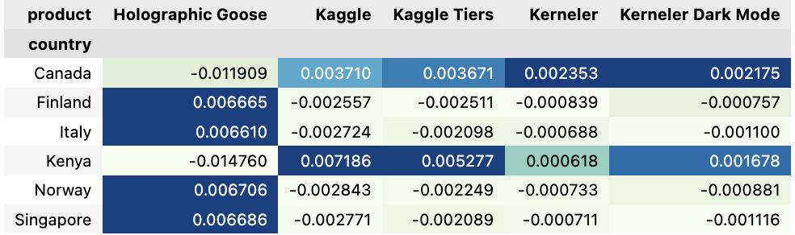
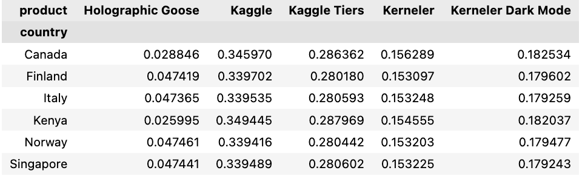
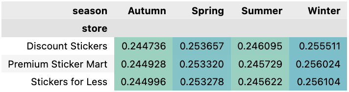

# Playground Series S5E1 Kaggle Competition

This repository contains the work for the **Playground Series S5E1** competition hosted on Kaggle. The goal of this competition is to create a predictive model that can forecast product sales for a set of stores, products, and countries.

## Table of Contents
1. Competition Overview
2. Installation
   - Creating a Virtual Environment
   - Installing Dependencies
3. Model Overview
4. Submission Instructions
5. Learnings

## Competition Overview

This competition challenges participants to build a predictive model for forecasting product sales across different stores, products, and countries. The dataset includes historical sales data, and the task is to predict future sales accurately.

- **Dataset**: Provided by Kaggle.
- **Evaluation Metric**: The model will be evaluated based on **Mean Absolute Percentage Error (MAPE)**.

## Installation

### Creating a Virtual Environment

To get started, it is recommended to create a virtual environment for this project to keep dependencies isolated and manageable. Follow these steps:

1. **Install Python**: Make sure Python (3.7 or higher) is installed on your system. You can download it from [python.org](https://www.python.org/).

2. **Create a virtual environment**:

   ```bash
   python -m venv venv´´´

Activate the virtual environment:

On Windows:

```bash
.\venv\Scripts\activate
```

On Mac/Linux:

```bash
source venv/bin/activate
```

Installing Dependencies
Install the required packages from requirements.txt:

```bash
pip install -r requirements.txt
```

This will install all the necessary libraries needed to run the notebook, including:


### Model Overview

In this project, we apply various machine learning models and techniques to forecast product sales, including:

XGBoost Regressor: For boosting the prediction accuracy by creating an ensemble of decision trees.
Prophet Model: For time series forecasting.
Ridge Regression: For time series forecasting.
Lasso Regression: For time series forecasting.
Feature Engineering: We extract features such as product, store, seasonality, and more.
The model is trained on historical sales data, and we tuned hyperparameters using GridSearchCV to improve performance. The best model is evaluated on the test set using Mean Absolute Percentage Error (MAPE).

### Learnings

The data had many missing values for Canada and Kenya.


In the exploratory, we also note that within the breakdowns by product, store, and country, there is a generally consistent ratio. 




### License

This project is licensed under the MIT License - see the LICENSE file for details.