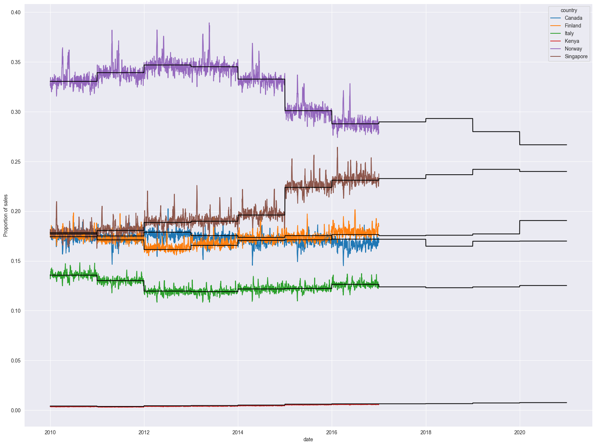
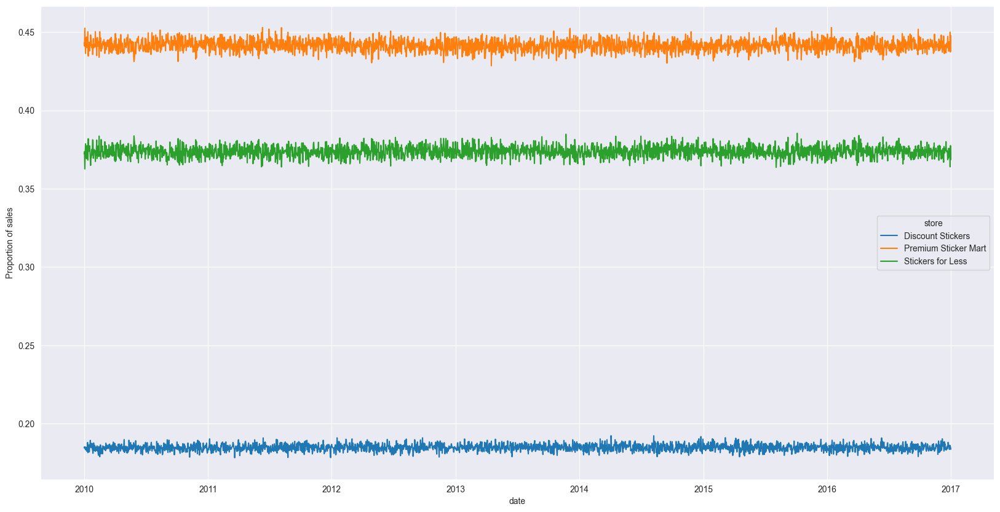
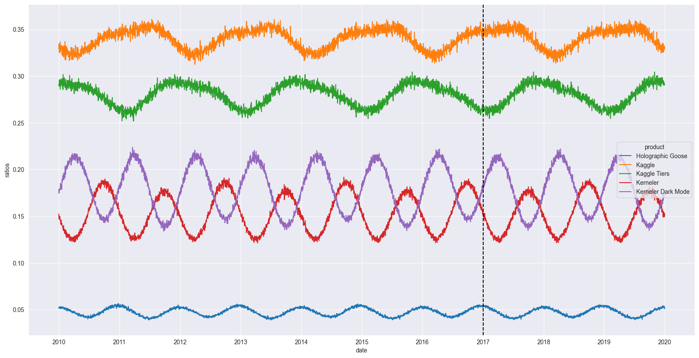
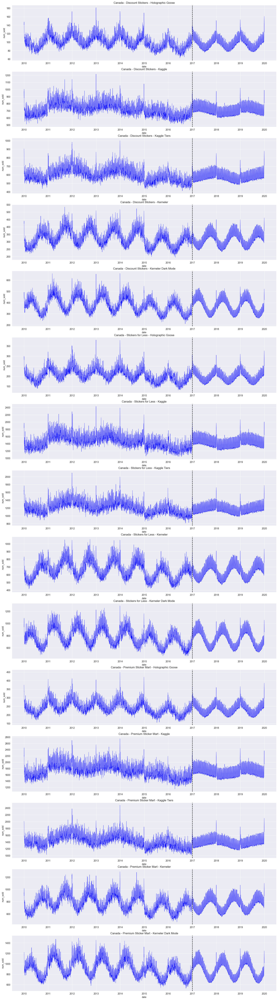

# Playground Series S5E1 Kaggle Competition

This repository contains the work for the **Playground Series S5E1** competition hosted on Kaggle. The goal of this competition is to create a predictive model that can forecast product sales for a set of stores, products, and countries.

## Table of Contents
1. Competition Overview
2. Installation
   - Creating a Virtual Environment
   - Installing Dependencies
3. Model Overview
4. Submission Instructions
5. Learnings

## Competition Overview

This competition challenges participants to build a predictive model for forecasting product sales across different stores, products, and countries. The dataset includes historical sales data, and the task is to predict future sales accurately.

- **Dataset**: Provided by Kaggle.
- **Evaluation Metric**: The model will be evaluated based on **Mean Absolute Percentage Error (MAPE)**.

### Model Overview

We first note that there are 6 countries, 3 stores, and 5 products, all of which are distributed in equal proportions of observations indicating that there is completeness of time series data across categories. 

We then observe that there are missing values. The missing values occur for Kenya and Canada for 2 products across all stores. There are two types of missing values: completely missing segments (Holographic Goose, Discount Stickers, Canada and Kenya) and interpolated missing values (Holographic Goose and Kerneler, Premium Sticker Mart and Stickers for Less, Canada and Kenya)

We then observe that the trends are relatively consistent across countries, which gives us an indication that we may be able to aggregate the sales to make a simplified forecast. To validate this we look at the proportions of sales for each country to see if the proportions of sales remain constant over time. We see that there is some variation over time, but the variation is unusual because it tends to have jumps every year. 

The secret was that the GDP of each country changes yearly. We plot the GDP ratio against the country market share ratio and see a consistent trend. 



We then look at the store level ratios to make sure we can de-aggregate data if we were to use an aggregate forecast. The store ratios look consistent over time.



We then look at the product ratios. The product ratios vary over time and see that there is variation. However, there is a clear sin wave pattern to the product ratios. This allows us to forecast the product ratio using the historical trend. 



Finally, we forecast the aggregated sales data, then use the GDP normalized country ratios, the store ratios, and the forecasted product ratios to deaggregate the aggregated sales forecast. 

[](images/forecasts.png)


## Installation

### Creating a Virtual Environment

To get started, it is recommended to create a virtual environment for this project to keep dependencies isolated and manageable. Follow these steps:

1. **Install Python**: Make sure Python (3.7 or higher) is installed on your system. You can download it from [python.org](https://www.python.org/).

2. **Create a virtual environment**:

   ```bash
   python -m venv venv´´´

Activate the virtual environment:

On Windows:

```bash
.\venv\Scripts\activate
```

On Mac/Linux:

```bash
source venv/bin/activate
```

Installing Dependencies
Install the required packages from requirements.txt:

```bash
pip install -r requirements.txt
```

This will install all the necessary libraries needed to run the notebook, including:


### License

This project is licensed under the MIT License - see the LICENSE file for details.